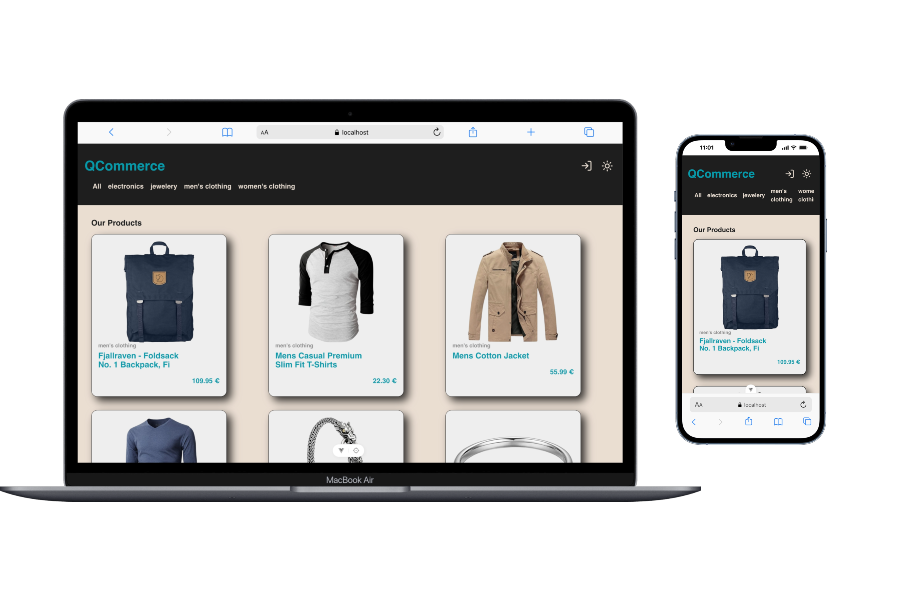

# Q Commerce

E-Commerce basato sul API "Fake Store API" creato utilizzando Vue con Typescript. Possibilità di vedere tutti prodotti a schermo e divisi in categorie, possibilità di fare un login per poter aggiungere i prodotti al carrello.



## Tecnologie

- **Vue 3**
- **TypeScript**
- **Vite**
- **Vue Router**
- **Pinia**
- **EsLint**
- **Vitest**
- **Fake Store API** (https://fakestoreapi.com)

## Struttura Progetto

- **Components**: Componenti riutilizzabili in pagine differenti
- **Views**: Le pagine della nostra App
- **Stores**: Store creato con Pinia per fare da state management
- **Services**: Funzioni che fanno chiamate al API
- **Types**: Interfacce TypeScript per l'entità dei vari elementi del API che usiamo nella nostra App
- **Router**: Configurazione delle nostre Routes
- **Styles**: File .css per il design della nostra app
- **Tests**: File test unitari per la nostra app

## Setup

### Prerequisiti

- Node.JS
- npm

### Installazione

```bash
git clone 'https://github.com/AlexGioffDev/store-quibica'
cd store-quibica
npm install
```

### ENV

Nella Route del progetto creare un file .env

```
VITE_API_BASE_URL=https://fakestoreapi.com
```

### Avvio

```bash
npm run dev
```

L'app sarà su `http://localhost:5173`

### Funzionalità

- **Tema Chiaro/Scuro**: Nel Header disponibile un bottone che permette di cambiare il tema della pagina da chiaro a scuro.
- **Home**: Pagina principale dove poter vedere tutti i prodotti rappresentati da una Card con immagine, parte del titolo e prezzo.
- **Filtro per Categoria**: Sempre nella HomePage attraverso query è possibile filtrare i prodotti in base alla categoria, le categorie sono prese dal API stessa e il contenuto viene riportato fedelmente
- **Autenticazione**: Possibilità di fare login (usare uno degli users del API (https://fakestoreapi.com/users)) per autenticarsi
- **Carrello**: Se autenticati possibilità di aggiungere al carrello i prodotti, con counter visibile nel header, più Menu ad apparizione, attraverso un bottone visibile sia nella product card del menu che nella pagina del Prodotto stesso.

### AI

Durante lo sviluppo del progetto è stata utilizza l'AI fortina da Claude, il suo utilizzo è stato da collaborattore del progetto specialmente lato Store e Test, in quanto Vue non sia un framework da me spesso utilizzato. Il codice prodotto è stato confrontato con quanto trovato anche nelle documentazioni ufficiali ed in forum online riportate da altri programmatori per poi infine essere testato manualmente per controllare non ci fossero effettivi errori in quanto riportato. Un ulteriore aiuto è stato dato nella creazione di una roadmap per dividere il progetto in fasi e lavorare cosi step by step seguendo una precisa logica.
